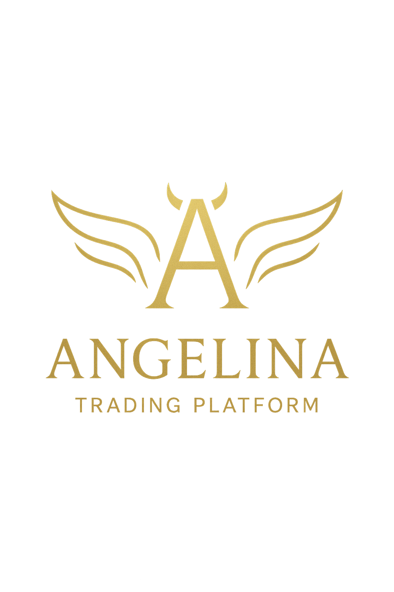

[EN](README.md)

# Angelina Trading Platform

**Angelina Trading Platform** — это экосистема для автоматизации торговли на фондовом рынке и анализа рыночных данных, ориентированная на алгоритмическую, стратегическую торговлю и снижение влияния человеческого фактора при принятии торговых решений.

В основе платформы лежит высокопроизводительное торговое ядро — **Scorpion Engine**, отвечающее за исполнение стратегий, анализ рынка и контроль рисков.

---

## Обзор

Платформа создаётся с целью упростить доступ к автоматизированной торговле и сделать её понятной и удобной для широкой аудитории — от обычных пользователей до опытных трейдеров,  
при этом сохраняя полный контроль пользователей над своими брокерскими счетами и средствами.

Ручная торговля часто подвержена эмоциям: страху, жадности, сомнениям и импульсивным решениям.  
Даже опытные трейдеры совершают ошибки, когда эмоции начинают влиять на исполнение стратегии.

Angelina Trading Platform создана для решения этой проблемы — путём предоставления структурированной, воспроизводимой и прозрачной автоматизации торговли на основе заранее определённых стратегий.

Пользователи подключают свои брокерские счета через API-ключи, выбирают стратегии и включают автоматическую торговлю — без передачи средств или активов платформе, либо получают торговые сигналы для самостоятельного принятия решений.

---

## Основная идея

Ключевые принципы платформы:

- **Алгоритмическая торговля, ориентированная на стратегии**, а не на эмоции
- **Контролируемая автоматизация** всего торгового процесса — от анализа и поиска точек входа до исполнения сделок и выхода из позиции
- **Отсутствие кастодиального хранения** — средства всегда остаются у брокера
- **Чёткое разделение** пользовательского доступа и торговой логики

Автоматизация рассматривается не как замена пониманию рисков, а как инструмент дисциплины, последовательности и повторяемости торговых решений.

---

## Структура платформы

### Angelina Trading Platform
Общая экосистема, предоставляющая доступ к автоматизированной торговле и работе со стратегиями.

Состоит из двух основных компонентов:

### Angelina Platform
Сервисный и пользовательский уровень, отвечающий за:
- управление пользовательскими аккаунтами и подписками
- выбор и конфигурацию торговых стратегий
- подключение брокерских счетов через API-ключи пользователей
- уведомления, отчётность и обратную связь системы
- административное и операционное управление платформой

Angelina Platform **не выполняет торговые операции напрямую**.

### Scorpion Engine
Высокопроизводительное торговое ядро, отвечающее за:
- исполнение торговых стратегий
- обработку рыночных данных
- оркестрацию сделок через API брокеров
- логику управления рисками

Scorpion Engine проектируется как самостоятельный торговый движок и в перспективе может предоставляться в виде отдельного API-продукта.

---

## Пользовательский опыт и онбординг

Платформа ориентирована на понятный и последовательный пользовательский сценарий:

- минималистичный интерфейс без лишнего информационного шума
- пошаговые сценарии подключения и настройки
- подробные инструкции по получению и настройке API-ключей брокеров
- прозрачные объяснения на всех критически важных этапах работы

---

## Режимы торговли

Платформа поддерживает несколько вариантов взаимодействия в зависимости от предпочтений пользователя:

- **Песочница (Sandbox / Paper Trading)**  
  Оценка стратегий без реального исполнения сделок — с использованием симулированных ордеров и реалистичных метрик эффективности.

- **Торговые сигналы**  
  Пользователь получает сигналы и самостоятельно принимает решение об исполнении сделок.

- **Автоматическая торговля**  
  Выбранные стратегии исполняются автоматически через API брокеров с использованием предоставленных пользователем учётных данных.

---

## Торговые инструменты

**Текущий фокус:**
- акции

**Планируемая поддержка:**
- ETF
- деривативы (фьючерсы)
- валютные инструменты (FX)

Поддержка новых классов инструментов будет расширяться постепенно, с учётом дополнительных ограничений и механизмов контроля рисков.

---

## Архитектурные принципы

Angelina Trading Platform строится на модульной, сервисно-ориентированной архитектуре с чётким разделением зон ответственности.

Пользовательский доступ, конфигурация и оркестрация изолированы от логики исполнения сделок, анализа рынка и взаимодействия с внешними источниками данных.  
Такой подход повышает масштабируемость, устойчивость системы и упрощает её дальнейшее развитие.

---

## Статус проекта

Проект находится в активной разработке.

- Текущая стадия: **Pre-MVP**
- Начальный фокус: автоматизация торговли акциями
- Дальнейшее развитие: маркетплейс стратегий и доступ к Scorpion Engine как отдельному продукту

---

## Отказ от ответственности

Angelina Trading Platform не хранит средства пользователей, не является брокером и не предоставляет инвестиционных рекомендаций.

Все торговые операции выполняются через сторонних брокеров с использованием API-ключей, предоставленных пользователями.  
Пользователи сохраняют полный контроль над своими счетами, стратегиями и торговыми решениями.

---

## Автор

**Архитектура и разработка:** Stanislav Kuprienko

Angelina Trading Platform создаётся как долгосрочный проект, ориентированный на алгоритмическую торговлю, прозрачность и масштабируемую автоматизацию.

### ® Angelina ###

